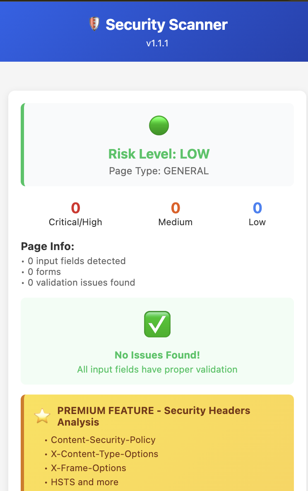
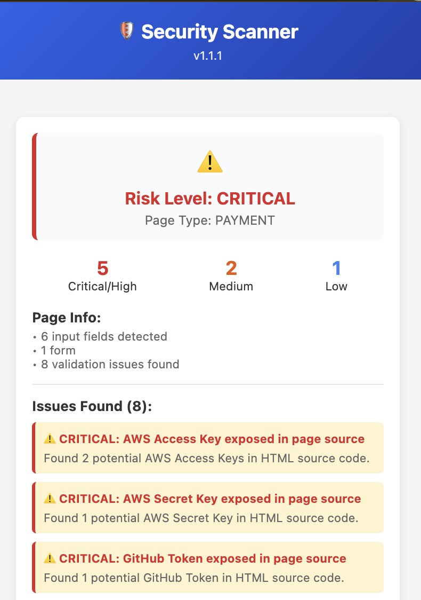

# 🛡️ Security Scanner

AI-Powered Browser Extension for Web Application Security Testing

---

## Problem → Solution

**Problem:** Manual security testing requires specialized expertise and takes hours per page.

**Solution:** One-click browser extension combining fast static analysis with AI-powered contextual intelligence.

**Result:** Critical vulnerabilities identified in <2 seconds with zero security expertise required.

### In Action

<table>
<tr>
<td align="center" valign="top"><b>Clean Site Detection</b></td>
<td align="center" valign="top"><b>Vulnerability Detection</b></td>
</tr>
<tr>
<td valign="top"></td>
<td valign="top"></td>
</tr>
</table>

---

## ✨ Core Features

- 🔴 **Input Validation** - Detects weak form field validation
- 🔐 **Exposed Secrets** - Finds API keys, tokens, and credentials in page source
- 🛡️ **Security Headers** - Premium feature analyzing CSP, X-Frame-Options, HSTS
- 🎯 **Risk Scoring** - Traffic light system for instant priority assessment
- ⚠️ **Smart Severity** - Issues ranked CRITICAL → HIGH → MEDIUM → LOW

---

## 🚨 Traffic Light Risk System

Instant visual priority assessment:

| Icon | Level | Action |
|------|-------|--------|
| ⚠️ | **CRITICAL** | Fix immediately - exploitable vulnerabilities |
| 🔴 | **HIGH** | Fix soon - significant security gaps |
| 🟠 | **MEDIUM** | Address - important issues to resolve |
| 🟢 | **LOW** | Minor issues or validation best practices |

---

## 🚀 Get Started

1. Download or clone this repository
2. Open `chrome://extensions/`
3. Enable "Developer mode" (top right)
4. Click "Load unpacked"
5. Select the `src/` folder
6. Click the 🛡️ icon in your toolbar to scan

---

## 📊 Current Status

✅ Extension loads and scans successfully  
✅ Input validation detection working  
✅ Exposed secrets scanner active (AWS keys, GitHub tokens, etc.)  
✅ Security headers detection (premium feature)  
✅ v1.1.1 deployed with enhanced premium pane visibility

---

## 📚 Documentation

- **[Design & Architecture](DESIGN.md)** - Technical approach and methodology
- **[Setup Instructions](SETUP_INSTRUCTIONS.md)** - Detailed installation guide

---

## 🎯 Project Goals

**Primary:** Demonstrate AI/ML integration in QA workflows  
**Secondary:** Create useful tool for security-conscious developers  
**Learning:** Apply Anthropic Academy course concepts in real project

---

## ⚖️ Ethical Use

**Acceptable:**
- ✅ Testing your own websites
- ✅ Testing with explicit permission
- ✅ Educational and research purposes
- ✅ Read-only analysis of public pages

**Prohibited:**
- ❌ Unauthorized penetration testing
- ❌ Exploitation of vulnerabilities
- ❌ Automated large-scale scanning
- ❌ Circumventing security controls

This tool is for responsible security assessment only.

---

## 📧 Contact

**Lynda M Birss**  
📱 [GitHub Profile](https://github.com/lyndabirss)

For inquiries, please reach out via GitHub.

---

## 🙏 Acknowledgments

- **Anthropic** for Claude API and Academy course
- **OWASP** for security testing methodologies
- **Open source security community** for vulnerability databases

---

*Personal project developed on personal time using personal resources for professional development.*

---

## 📄 License

**MIT License**

Copyright © 2025 Lynda M Birss

Permission is hereby granted, free of charge, to any person obtaining a copy of this software and associated documentation files (the "Software"), to deal in the Software without restriction, including without limitation the rights to use, copy, modify, merge, publish, distribute, sublicense, and/or sell copies of the Software, and to permit persons to whom the Software is furnished to do so, subject to the following conditions:

The above copyright notice and this permission notice shall be included in all copies or substantial portions of the Software.

THE SOFTWARE IS PROVIDED "AS IS", WITHOUT WARRANTY OF ANY KIND, EXPRESS OR IMPLIED, INCLUDING BUT NOT LIMITED TO THE WARRANTIES OF MERCHANTABILITY, FITNESS FOR A PARTICULAR PURPOSE AND NONINFRINGEMENT. IN NO EVENT SHALL THE AUTHORS OR COPYRIGHT HOLDERS BE LIABLE FOR ANY CLAIM, DAMAGES OR OTHER LIABILITY, WHETHER IN AN ACTION OF CONTRACT, TORT OR OTHERWISE, ARISING FROM, OUT OF OR IN CONNECTION WITH THE SOFTWARE OR THE USE OR OTHER DEALINGS IN THE SOFTWARE.
